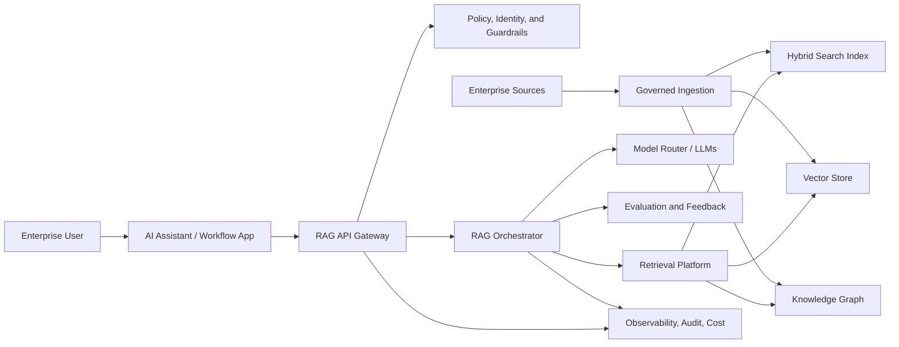
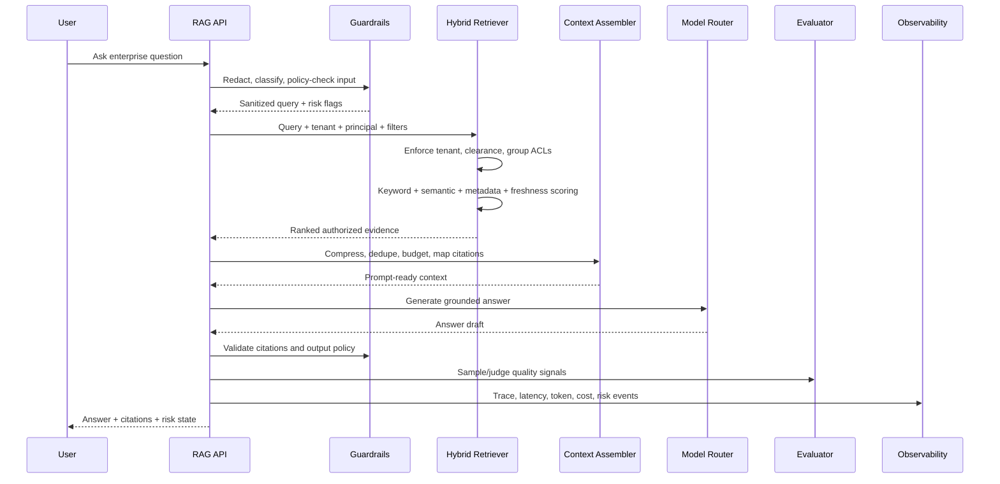
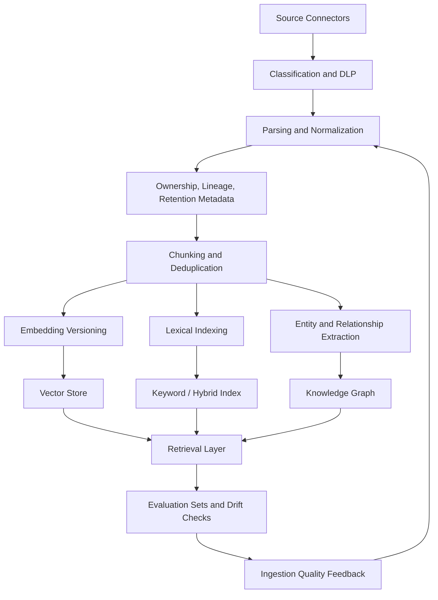
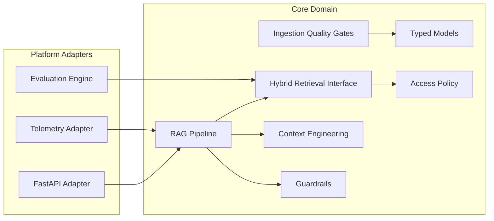

# Enterprise RAG Platform

Production RAG is a governed intelligence system, not a vector database wrapper. This project is a reference implementation and architecture package for an enterprise retrieval-augmented generation platform with access-aware retrieval, context engineering, evaluation, guardrails, observability, and operational decision records.

## Architecture Principles

- Retrieval strategy is the primary architecture decision; vector database choice is an implementation detail.
- Authorization happens before ranking, not after generation.
- Every answer must carry citations, ownership, freshness, and traceability.
- Prompts, retrieval logic, embeddings, and evaluations are versioned release artifacts.
- The system is designed for continuous improvement through telemetry, feedback, and regression testing.

## System Context



## Runtime Request Flow



## Data and Knowledge Lifecycle



## Component Boundaries



## Repository Layout

```text
enterprise_rag_platform/
  src/enterprise_rag/
    api/              Optional HTTP adapter
    core/             Business-critical RAG boundaries
    eval/             Offline quality metrics
    ops/              Telemetry facade
  docs/
    adr/              Architecture decision records
    risk-register.md  Production risks and mitigations
    operating-model.md
    scalability.md
  tests/              Standard-library unit tests
```

## Production Decisions

| Area | Decision | Impact |
| --- | --- | --- |
| Retrieval | Use hybrid retrieval with metadata filters and reranking extension point | Improves exact-term, semantic, and business-context recall |
| Security | Apply tenant, group, and classification checks before ranking | Prevents leaking unauthorized context into prompts |
| Context | Dedupe, compress, cite, and token-budget evidence before generation | Reduces hallucination and improves traceability |
| Evaluation | Maintain offline retrieval and grounding metrics plus online feedback | Enables safe iteration instead of anecdotal QA |
| Operations | Trace latency, retrieval scores, citations, risk flags, token/cost events | Makes production behavior debuggable |
| Future Proofing | Keep vector store, LLM, graph, and reranker behind ports/interfaces | Allows model and vendor changes without rewriting workflows |

## Local Verification

The core tests use only the Python standard library:

```bash
cd enterprise_rag_platform
PYTHONPATH=src python -m unittest discover -s tests
```

To run the optional API adapter after installing dependencies:

```bash
cd enterprise_rag_platform
python -m pip install -e ".[dev]"
uvicorn enterprise_rag.api.app:app --reload
```

## Production Hardening Checklist

- Replace `InMemoryHybridRetriever` with OpenSearch plus vector-store and graph adapters.
- Add a cross-encoder reranker and query rewrite service.
- Add embedding/model version tables and blue-green index deployment.
- Integrate OpenTelemetry exporters, SIEM audit sinks, and cost dashboards.
- Add prompt/version CI gates with golden datasets.
- Add human approval workflows for destructive or regulated actions.
- Add content retention, legal hold, and source-of-truth ownership workflows.
- Run red-team tests for prompt injection, authorization bypass, and citation spoofing.
