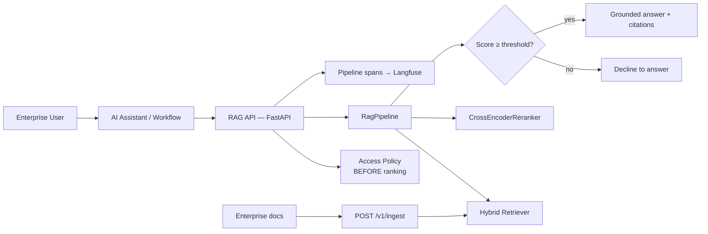
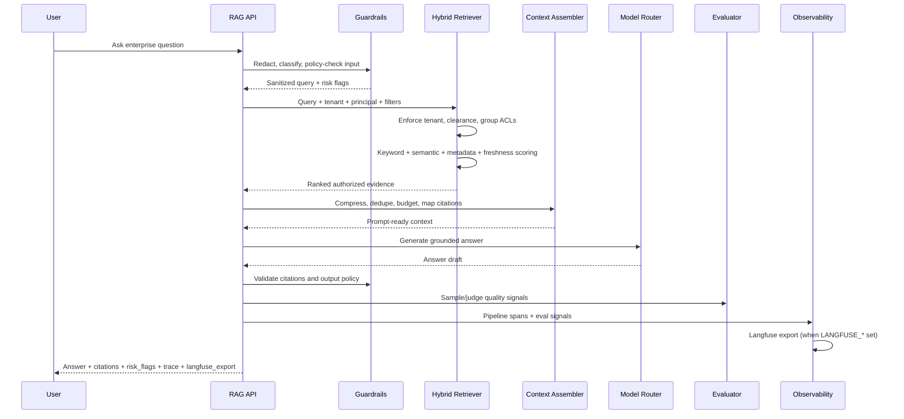
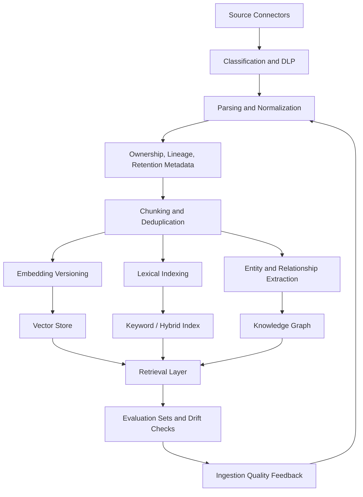
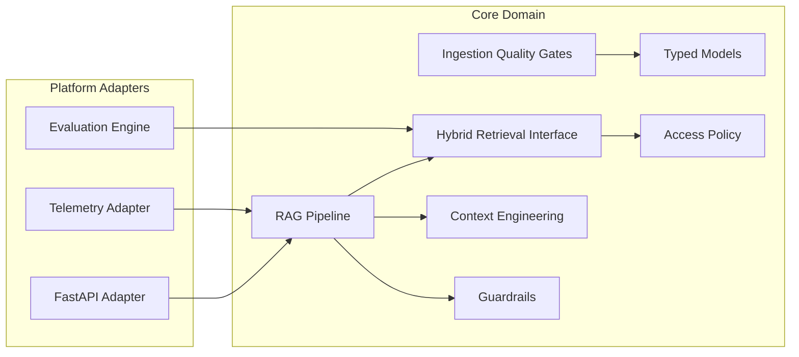

# Enterprise RAG Platform


<!-- vpeetla-tech-stack:start -->
[]() []() []() []() []() []() []()
<!-- vpeetla-tech-stack:end -->
## Agent skills (Cursor + Codex)

Org skills: [vpeetla-ai-skills](https://github.com/vpeetla-ai/vpeetla-ai-skills). This repo includes `.cursor/skills/`, `AGENTS.md`, and `CONTEXT.md`.

```bash
git clone https://github.com/vpeetla-ai/vpeetla-ai-skills.git
./vpeetla-ai-skills/scripts/install.sh --cursor --codex --project .
```

---

[](https://enterprise-rag-platform-eta.vercel.app)

[▶ Live demo](https://enterprise-rag-platform-eta.vercel.app) · [🚀 Deploy guide](docs/LIVE_DEMO.md) · [Architecture hub](docs/ARCHITECTURE.md) · [Ecosystem map](docs/ECOSYSTEM.md)

> **First-run note:** The Render API sleeps after inactivity on the free tier — the first request takes ~50s to wake, and the seeded corpus re-ingests on cold start. If a query returns empty, wait and retry once.

Production RAG is a governed intelligence system, not a vector database wrapper. This project is a reference implementation and architecture package for an enterprise retrieval-augmented generation platform with access-aware retrieval, context engineering, evaluation, guardrails, observability, and operational decision records.

**Portfolio:** [Case study](https://github.com/vpeetla-ai/ai-architecture-portfolio/blob/main/case-studies/enterprise-rag-platform.md) · [Architecture](docs/ARCHITECTURE.md) · [Ecosystem](docs/ECOSYSTEM.md) · [Deploy](docs/LIVE_DEMO.md)

## Architecture Principles

- Retrieval strategy is the primary architecture decision; vector database choice is an implementation detail.
- Authorization happens before ranking, not after generation.
- Every answer must carry citations, ownership, freshness, and traceability.
- Prompts, retrieval logic, embeddings, and evaluations are versioned release artifacts.
- The system is designed for continuous improvement through telemetry, feedback, and regression testing.

## Implementation Status

| Capability | Status | Notes |
| --- | --- | --- |
| Access-before-ranking | **Implemented** | `AccessPolicy` before scoring. Demo body Principal; Strict JWT (ADR-0006/0009). |
| Hybrid retrieval (BM25 + dense + RRF) | **Implemented** | BM25 k1/b + embeddings (`hash`/`local`/`openai`) fused with RRF ([ADR-0008](docs/adr/0008-dual-demo-strict-retrieval-profiles.md)) |
| Page-aware PDF ingest + citations | **Implemented** | `POST /v1/ingest/pdf` (PyMuPDF); `Citation.page` ([ADR-0007](docs/adr/0007-page-aware-ingest-and-citations.md)) |
| Retriever / Reranker ports | **Implemented** | Protocols + startup-loaded reranker |
| Cross-encoder reranker | **Implemented (Strict image)** | `RAG_RERANKER=cross_encoder` in full Docker; Demo may use `score_boost` |
| Decline-to-answer | **Implemented** | Per-scale thresholds; faithfulness may decline |
| Faithfulness gate | **Implemented** | Lexical entailment; no citation spoof fallback |
| LLM grounded generator | **Partial** | `GENERATOR=llm` when keys set; default extractive / `MOCK_LLM` for CI |
| Pipeline telemetry spans | **Implemented** | Per-request `EventRecorder` + audit JSONL + p95 |
| Guardrails + HITL risk flags | **Implemented** | PII redaction, `human_approval_required` |
| HTTP API | **Implemented** | `/health`, `/v1/answer`, `/v1/ingest`, `/v1/ingest/pdf`, `/v1/strategies` |
| Ingestion data contract + lineage | **Implemented** | 422 blocking issues; `content_hash` + page bounds |
| Golden eval / GER CI gate | **Implemented** | Shared registry + local page citation tests |
| Vector store adapter (Qdrant) | **Implemented** | Real vectors + filtered search (legacy scroll opt-in only) |
| OCR for scanned PDFs | **Not shipped** | Returns `ocr_required` until Phase-5 flag path |
| AegisAI gateway bridge | **Implemented** | Ingest + high-risk answers |
| Langfuse trace export | **Implemented** | When `LANGFUSE_*` set |
| Knowledge graph expansion | **Implemented** | In-memory entity expander |
| API-key gate | **Implemented** | `RAG_API_KEY` when set |
| Glass-box demo UX | **Implemented** | Live spans preferred; `demo_fallback` only if API unreachable |
| Dual Demo/Strict profiles | **Implemented** | See [docs/PROFILES.md](docs/PROFILES.md) · [TOP1PCT_ERAG_PROGRAM.md](docs/TOP1PCT_ERAG_PROGRAM.md) |

See [docs/ECOSYSTEM.md](docs/ECOSYSTEM.md) for how this repo connects to VAP, AegisAI, and AgentOps.

## System Context

Canonical: [`docs/diagrams/canonical-architecture.mmd`](docs/diagrams/canonical-architecture.mmd)


```mermaid
flowchart LR
  User["Enterprise User"] --> App["AI Assistant / Workflow"]
  App --> Gateway["RAG API — FastAPI"]
  Gateway --> Policy["Access Policy<br/>BEFORE ranking"]
  Gateway --> Orchestrator["RagPipeline"]
  Orchestrator --> Retrieval["Hybrid Retriever"]
  Orchestrator --> Rerank["CrossEncoderReranker"]
  Orchestrator --> Decline{"Score ≥ threshold?"}
  Decline -->|no| Refuse["Decline to answer"]
  Decline -->|yes| Gen["Grounded answer + citations"]
  Sources["Enterprise docs"] --> Ingestion["POST /v1/ingest"]
  Ingestion --> Retrieval
  Gateway --> Obs["Pipeline spans → Langfuse"]
```

*Solid boxes are implemented. LLM routers are extension points documented in ADRs.*

## Runtime Request Flow

*Solid path matches Implementation Status. Model Router / Evaluator are extension points — demo uses a single LLM path + golden eval CI, not a full multi-model router fleet.*


```mermaid
sequenceDiagram
  participant U as User
  participant API as RAG API
  participant G as Guardrails
  participant R as Hybrid Retriever
  participant C as Context Assembler
  participant M as Model Router
  participant E as Evaluator
  participant O as Observability

  U->>API: Ask enterprise question
  API->>G: Redact, classify, policy-check input
  G-->>API: Sanitized query + risk flags
  API->>R: Query + tenant + principal + filters
  R->>R: Enforce tenant, clearance, group ACLs
  R->>R: Keyword + semantic + metadata + freshness scoring
  R-->>API: Ranked authorized evidence
  API->>C: Compress, dedupe, budget, map citations
  C-->>API: Prompt-ready context
  API->>M: Generate grounded answer
  M-->>API: Answer draft
  API->>G: Validate citations and output policy
  API->>E: Sample/judge quality signals
  API->>O: Pipeline spans + eval signals
  O->>O: Langfuse export (when LANGFUSE_* set)
  API-->>U: Answer + citations + risk_flags + trace + langfuse_export
```

## Data and Knowledge Lifecycle

*Reference target for enterprise ingestion. Free-tier demo uses in-memory hybrid corpus + optional Qdrant — not every connector / DLP / graph box below ships on Render.*


```mermaid
flowchart TB
  A["Source Connectors"] --> B["Classification and DLP"]
  B --> C["Parsing and Normalization"]
  C --> D["Ownership, Lineage, Retention Metadata"]
  D --> E["Chunking and Deduplication"]
  E --> F["Embedding Versioning"]
  E --> G["Lexical Indexing"]
  E --> H["Entity and Relationship Extraction"]
  F --> I["Vector Store"]
  G --> J["Keyword / Hybrid Index"]
  H --> K["Knowledge Graph"]
  I --> L["Retrieval Layer"]
  J --> L
  K --> L
  L --> M["Evaluation Sets and Drift Checks"]
  M --> N["Ingestion Quality Feedback"]
  N --> C
```

## Component Boundaries


```mermaid
flowchart LR
  subgraph Core["Core Domain"]
    Models["Typed Models"]
    Access["Access Policy"]
    Ingest["Ingestion Quality Gates"]
    Retrieve["Hybrid Retrieval Interface"]
    Context["Context Engineering"]
    Guard["Guardrails"]
    Pipeline["RAG Pipeline"]
  end

  subgraph Platform["Platform Adapters"]
    API["FastAPI Adapter"]
    Obs["Telemetry Adapter"]
    Eval["Evaluation Engine"]
  end

  API --> Pipeline
  Pipeline --> Guard
  Pipeline --> Retrieve
  Pipeline --> Context
  Retrieve --> Access
  Ingest --> Models
  Eval --> Retrieve
  Obs --> Pipeline
```

## Repository Layout

```text
enterprise_rag_platform/
  src/enterprise_rag/
    api/              Optional HTTP adapter
    core/             Business-critical RAG boundaries
    eval/             Offline quality metrics
    ops/              Telemetry facade
  docs/
    adr/              Architecture decision records
    risk-register.md  Production risks and mitigations
    operating-model.md
    scalability.md
  tests/              Standard-library unit tests
```

## Production Decisions

| Area | Decision | Impact |
| --- | --- | --- |
| Retrieval | Use hybrid retrieval with metadata filters and reranking extension point | Improves exact-term, semantic, and business-context recall |
| Security | Apply tenant, group, and classification checks before ranking | Prevents leaking unauthorized context into prompts |
| Context | Dedupe, compress, cite, and token-budget evidence before generation | Reduces hallucination and improves traceability |
| Evaluation | Maintain offline retrieval and grounding metrics plus online feedback | Enables safe iteration instead of anecdotal QA |
| Operations | Trace latency, retrieval scores, citations, risk flags, token/cost events | Makes production behavior debuggable |
| Future Proofing | Keep vector store, LLM, graph, and reranker behind ports/interfaces | Allows model and vendor changes without rewriting workflows |

## Local Verification

The core tests use only the Python standard library:

```bash
cd enterprise_rag_platform
PYTHONPATH=src python -m unittest discover -s tests
```

To run the optional API adapter after installing dependencies:

```bash
cd enterprise_rag_platform
python -m pip install -e ".[dev]"
uvicorn enterprise_rag.api.app:app --reload
```

API surface:

| Endpoint | Purpose |
| --- | --- |
| `GET /health` | Liveness |
| `GET /v1/strategies` | Retrieval modes and reranker options |
| `POST /v1/ingest` | Add documents to the in-memory corpus |
| `POST /v1/answer` | Grounded answer with citations, risk flags, and trace |

## Principal review path — Demo vs Strict

| Mode | When | Principal trust | UI signal |
|------|------|-----------------|-----------|
| **Demo** (default live) | Portfolio / glass-box UX | Client-asserted body fields | Amber sticky banner · `GET /health` → `review_mode=demo` |
| **Strict** (recommended for panels) | `PRODUCTION_STRICT=1` + `RAG_JWT_SECRET` | JWT Bearer claims only (anti-spoof) | Green banner · `principal_source=jwt` |

Strict docs: [ADR-0006](docs/adr/0006-verified-principal-jwt-strict.md) · org [ADR-024](https://github.com/vpeetla-ai/ai-architecture-portfolio/blob/main/adr/ADR-024-production-strict-fail-closed.md).

## Production Hardening Checklist

- **JWT-verified `Principal` under `PRODUCTION_STRICT=1`** — shipped (see
  [ADR-0006](docs/adr/0006-verified-principal-jwt-strict.md) / portfolio ADR-024).
  Default demo still allows client-asserted Principal for lab UX; do not run demo mode
  against real tenants. `RAG_API_KEY` alone is not identity.
- Replace `InMemoryHybridRetriever` with OpenSearch plus vector-store and graph adapters
  for durable multi-tenant corpora (Qdrant adapter exists; free-tier demo stays in-memory).
- Add query rewrite / multi-hop expansion beyond the current hybrid + cross-encoder path.
- Add embedding/model version tables and blue-green index deployment.
- Integrate SIEM audit sinks and cost dashboards (optional — Langfuse covers trace-linked LLMOps today).
- Prompt/version CI gates — golden + adversarial suites via golden-eval-registry (partially shipped).
- Add human approval workflows for destructive or regulated actions (AegisAI HITL bridge exists).
- Add content retention, legal hold, and source-of-truth ownership workflows.
- Expand red-team coverage beyond the adversarial golden suite (injection, citation spoofing).

## Interview map

**Business function:** Production RAG — access-before-ranking, hybrid retrieval, citations, decline-to-answer, evals.

Staff+ prep crosswalk — [playbook](https://github.com/vpeetla-ai/ai-architect-interview-playbook) · [study UI](https://ai-architect-interview-playbook.vercel.app) · [Practice Arena](https://ai-architect-practice-arena.vercel.app) · [org matrix](https://github.com/vpeetla-ai/ai-architecture-portfolio/blob/main/docs/REPO_INTERVIEW_MAP.md). Only entries this repo honestly exercises.

| Category | Entry | Fit |
|----------|-------|-----|
| System design | [RAG platform at scale](https://ai-architect-interview-playbook.vercel.app/q/ai-system-design/02-rag-platform-at-scale/) ([md](https://github.com/vpeetla-ai/ai-architect-interview-playbook/blob/main/ai-system-design/02-rag-platform-at-scale.md)) | Primary map — ACL filter, hybrid retrieve, rerank, citations |
| Cloud | [Security & compliance for AI](https://ai-architect-interview-playbook.vercel.app/q/cloud-architecture/05-security-and-compliance-architecture-for-ai-systems/) ([md](https://github.com/vpeetla-ai/ai-architect-interview-playbook/blob/main/cloud-architecture/05-security-and-compliance-architecture-for-ai-systems.md)) | Clearance / ACL on chunks before ranking |
| Trade-offs | [Cost vs latency vs safety](https://ai-architect-interview-playbook.vercel.app/q/scalability-governance-tradeoffs/01-cost-vs-latency-vs-safety/) ([md](https://github.com/vpeetla-ai/ai-architect-interview-playbook/blob/main/scalability-governance-tradeoffs/01-cost-vs-latency-vs-safety.md)) | Rerank vs latency; decline vs wrong answer |

