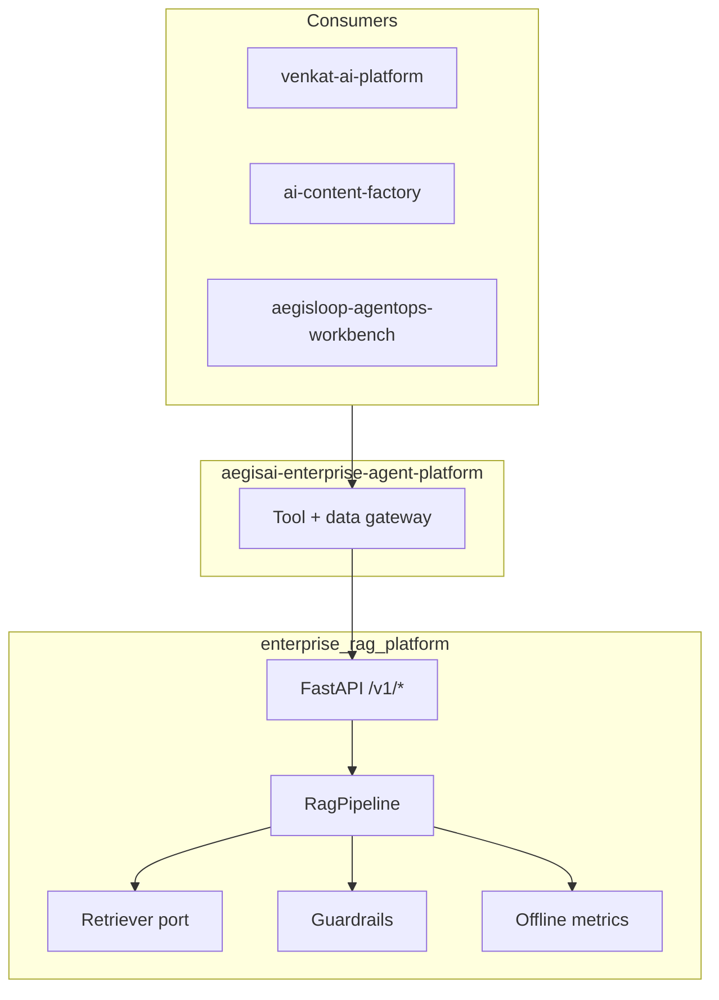

# Enterprise RAG Platform — Architecture Hub

**Role in portfolio:** Knowledge layer — access-aware retrieval, context assembly, guardrails, and eval hooks.

**Live demo:** [enterprise-rag-platform.vercel.app](https://enterprise-rag-platform.vercel.app)  
**Related:** [ECOSYSTEM.md](ECOSYSTEM.md) · [ADR index](adr/)

---

## System context



---

## Core design principles

| Principle | Implementation |
|-----------|----------------|
| **Access before ranking** | `AccessPolicy` filters candidates before hybrid scoring ([ADR-0002](adr/0002-access-before-ranking.md)) |
| **Hybrid retrieval** | BM25 + dense in-memory retriever; ports for vector DB ([ADR-0001](adr/0001-hybrid-retrieval.md)) |
| **Versioned eval gates** | Golden queries + regression thresholds ([ADR-0003](adr/0003-versioned-evaluation-gates.md)) |
| **Policy at boundary** | Guardrails emit `human_approval_required` for gateway consumers |

---

## Request path (`POST /v1/answer`)

```text
Principal + tenant context
  → AccessPolicy.filter(corpus)
  → Retriever.retrieve(query, strategy)
  → Reranker.rerank(candidates)
  → ContextAssembler.build(citations)
  → Guardrails.check(answer, evidence)
  → Response + risk_flags + telemetry spans
```

| Stage | Module | Notes |
|-------|--------|-------|
| Ingest | `/v1/ingest` | Governed document intake |
| Strategies | `/v1/strategies` | Multi-query, HyDE experiments (VAP promotes winners here) |
| Answer | `/v1/answer` | Primary RAG surface for platform integrations |

---

## Ports (extension points)

| Port | v1 implementation | Planned |
|------|-------------------|---------|
| `Retriever` | `InMemoryHybridRetriever` | Qdrant / Pinecone adapter |
| `Reranker` | `ScoreBoostReranker` | Cross-encoder |
| Telemetry | `EventRecorder` in pipeline | OTLP exporter |
| LLM synthesis | Configurable provider | Live path in prod deploy |

---

## Integration contracts

| Consumer | Integration |
|----------|-------------|
| **VAP** | RAG strategy lab compares strategies; promote adapter implementing `Retriever` |
| **AegisAI** | Honor `risk_flags.human_approval_required` before returning sensitive answers |
| **Content Factory** | Internal policy grounding via `/v1/answer` with tenant principal |
| **AegisLoop** | Import `tests/fixtures/golden_queries.json` into mission regression |

---

## Implementation status

| Area | Status |
|------|--------|
| Access-before-ranking | ✅ |
| Hybrid in-memory retrieval | ✅ |
| Reranker port + reference reranker | ✅ |
| Pipeline telemetry spans | ✅ |
| HTTP API (`/health`, `/v1/answer`, `/v1/ingest`, `/v1/strategies`) | ✅ |
| Vector DB / graph backends | 🟡 Behind ports only |
| Cross-encoder reranker | 🟡 Plug into `Reranker` |
| OTLP export | ✅ | `ops/otel_export.py` — set `OTEL_EXPORTER_OTLP_ENDPOINT` |
| Online eval feedback loop | 🟡 Offline metrics in `eval/metrics.py` |

---

## Deployment topology

| Surface | Host | Notes |
|---------|------|-------|
| Demo UI | Vercel | Static + API proxy |
| API | Render / local | FastAPI, env-driven LLM keys |

---

## ADRs

- [0001 — Hybrid retrieval](adr/0001-hybrid-retrieval.md)
- [0002 — Access before ranking](adr/0002-access-before-ranking.md)
- [0003 — Versioned evaluation gates](adr/0003-versioned-evaluation-gates.md)
