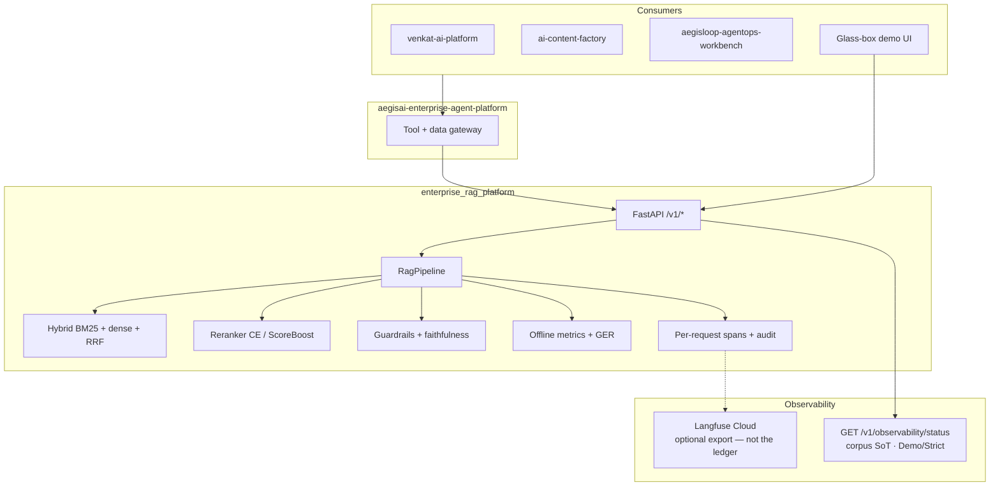

# Enterprise RAG Platform — Architecture Hub

**Role in portfolio:** Knowledge layer — access-aware retrieval, page-cited PDF Q&A, context assembly, guardrails, and eval hooks.

**Live demo:** [enterprise-rag-platform-eta.vercel.app](https://enterprise-rag-platform-eta.vercel.app)  
**Program:** [TOP1PCT_ERAG_PROGRAM.md](TOP1PCT_ERAG_PROGRAM.md) · [PROFILES.md](PROFILES.md) · [ADR index](adr/)

---

## System context


```mermaid
flowchart TB
  subgraph Clients["Consumers"]
    VAP["venkat-ai-platform"]
    ACF["ai-content-factory"]
    AL["aegisloop-agentops-workbench"]
    Demo["Glass-box demo UI"]
  end

  subgraph Gateway["aegisai-enterprise-agent-platform"]
    GW["Tool + data gateway"]
  end

  subgraph RAG["enterprise_rag_platform"]
    API["FastAPI /v1/*"]
    PIPE["RagPipeline"]
    RET["Hybrid BM25 + dense + RRF"]
    RR["Reranker CE / ScoreBoost"]
    GR["Guardrails + faithfulness"]
    EVAL["Offline metrics + GER"]
    TEL["Per-request spans + audit"]
  end

  subgraph Obs["Observability"]
    ST["GET /v1/observability/status<br/>corpus SoT · Demo/Strict"]
    LF["Langfuse Cloud<br/>optional export — not the ledger"]
  end

  Clients --> GW
  Demo --> API
  GW --> API
  API --> PIPE
  PIPE --> RET
  PIPE --> RR
  PIPE --> GR
  PIPE --> EVAL
  PIPE --> TEL
  API --> ST
  TEL -.-> LF
```

I’d treat Qdrant/memory + access-before-ranking as the corpus ledger. Langfuse is optional export. `GET /v1/observability/status` says that out loud for panels (public; ops metrics stay key-gated under Strict).

---

## Core design principles

| Principle | Implementation |
|-----------|----------------|
| **Access before ranking** | `AccessPolicy` before BM25/dense scoring ([ADR-0002](adr/0002-access-before-ranking.md)) |
| **Hybrid + RRF** | BM25 (k1/b) + dense embeddings fused with RRF ([ADR-0001](adr/0001-hybrid-retrieval.md), [ADR-0008](adr/0008-dual-demo-strict-retrieval-profiles.md)) |
| **Page-aware PDF** | `/v1/ingest/pdf` + `Citation.page` ([ADR-0007](adr/0007-page-aware-ingest-and-citations.md)) |
| **Strict principal** | JWT `exp` on retrieve/answer/**ingest** ([ADR-0006](adr/0006-verified-principal-jwt-strict.md), [ADR-0009](adr/0009-strict-ingest-principal-binding.md)) |
| **Versioned eval gates** | Golden + adversarial suites ([ADR-0003](adr/0003-versioned-evaluation-gates.md)) |
| **Policy at boundary** | Decline, faithfulness, `human_approval_required` for gateway consumers |

---

## Request path (`POST /v1/answer`)

```text
Principal (body Demo | JWT Strict)
  → AccessPolicy (before score)
  → BM25 + dense → RRF
  → Rerank (optional)
  → Decline if low confidence / inject / unfaithful
  → ContextAssembler (page citations)
  → Generator (extractive | llm)
  → Guardrails (no citation spoof)
  → Response + risk_flags + per-request trace
```

| Stage | Module | Notes |
|-------|--------|-------|
| Ingest | `/v1/ingest`, `/v1/ingest/pdf` | Text or page-structured PDF |
| Strategies | `/v1/strategies` | Modes, fusion, embedders, generators |
| Answer | `/v1/answer` | Primary RAG surface |

---

## Ports (extension points)

| Port | v1 implementation | Notes |
|------|-------------------|-------|
| `Retriever` | `InMemoryHybridRetriever` · `QdrantHybridRetriever` | Real vectors + tenant filter on Qdrant |
| `Reranker` | `ScoreBoostReranker` · `CrossEncoderReranker` | Startup-loaded; CE in full Docker |
| `Embedder` | `hash` · `local` · `openai`/`gateway` | Dual posture (ADR-0008) |
| `Generator` | `ExtractiveGenerator` · `LlmGroundedGenerator` | `MOCK_LLM` / `GENERATOR=llm` |
| Telemetry | Per-request `EventRecorder` + audit JSONL | Langfuse export optional; posture on `/v1/observability/status` |

---

## Integration contracts

| Consumer | Integration |
|----------|-------------|
| **VAP** | RAG strategy lab / Enterprise RAG adapter |
| **AegisAI** | Honor `risk_flags.human_approval_required` |
| **Content Factory** | Policy grounding via `/v1/answer` |
| **AegisLoop** | Golden fixtures / mission regression |
| **Interview playbook** | Entries 02, 22, 23 |

---

## Implementation status

See root [README Implementation Status](../README.md#implementation-status) for the honest capability table (including OCR **Not shipped**).

## Related docs

- [STRICT_PANEL_PACK.md](STRICT_PANEL_PACK.md) — 3-minute PDF Q&A panel script  
- [OCR.md](OCR.md) — scanned PDF `ocr_required` contract  
- [LIVE_DEMO.md](LIVE_DEMO.md) — deploy  
- [ECOSYSTEM.md](ECOSYSTEM.md) — spine map  
