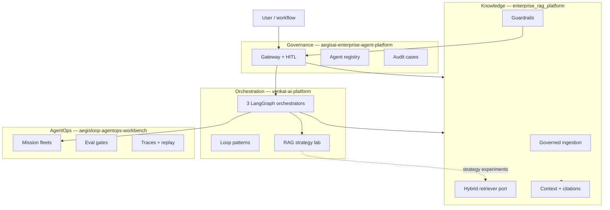

# Ecosystem — Enterprise RAG Platform

This repository is the **knowledge layer** in the Venkat AI portfolio. It owns access-aware retrieval, context assembly, guardrails at the RAG boundary, and evaluation hooks — not fleet orchestration or enterprise gateway policy.

## Where this repo sits

## Integration map

| Capability | Owner repo | This repo's role |
| --- | --- | --- |
| Hybrid / multi-query / HyDE RAG experiments | `venkat-ai-platform` | Reference **production-shaped** retrieval port (`Retriever`, `Reranker`) and policy-before-ranking |
| Gateway HITL for notify / destructive tools | `aegisai-enterprise-agent-platform` | Surfaces `human_approval_required` risk flags from guardrails for gateway consumers |
| Content pipeline + publish | `ai-content-factory` | Can call `/v1/answer` with tenant principal for grounded internal policy answers |
| Mission eval + traces | `aegisloop-agentops-workbench` | Shares eval vocabulary (grounding, evidence, policy); offline metrics in `eval/metrics.py` |

## Recommended wiring

1. **VAP RAG lab** — Compare strategies in VAP; promote winners to adapters implementing `enterprise_rag.core.retriever.Retriever`.
2. **AegisAI gateway** — When `human_approval_required` appears in `/v1/answer` risk_flags, route to gateway approval flow before returning to the user.
3. **AgentOps** — Import golden queries from `tests/fixtures/golden_queries.json` into mission regression suites.

## Implementation status (this repo)

| Area | Status |
| --- | --- |
| Access-before-ranking | Implemented (`AccessPolicy` + retriever filter) |
| Hybrid in-memory retrieval | Implemented (`InMemoryHybridRetriever`) |
| Reranker port + reference reranker | Implemented (`ScoreBoostReranker`) |
| Pipeline telemetry spans | Implemented (`EventRecorder` wired in `RagPipeline`) |
| Langfuse export (`ops/langfuse_export.py`) | Implemented — set `LANGFUSE_PUBLIC_KEY` + `LANGFUSE_SECRET_KEY` |
| Vector DB / graph adapters | Implemented behind ports (`QdrantHybridRetriever`, `InMemoryGraphExpander`) |
| HTTP API (`/health`, `/v1/answer`, `/v1/ingest`, `/v1/strategies`) | Implemented |
| Cross-encoder reranker | Planned — plug into `Reranker` protocol |
| Online eval feedback loop | Partial — offline metrics in `eval/metrics.py` |

## Related repositories

- [aegisai-enterprise-agent-platform](https://github.com/vpeetla-ai/aegisai-enterprise-agent-platform) — governance gateway
- [venkat-ai-platform](https://github.com/vpeetla-ai/venkat-ai-platform) — orchestration + RAG lab
- [aegisloop-agentops-workbench](https://github.com/vpeetla-ai/aegisloop-agentops-workbench) — AgentOps missions
- [ai-content-factory](https://github.com/vpeetla-ai/ai-content-factory) — content automation
