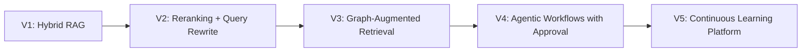

# Scalability and Future Proofing

## Scaling Dimensions

| Dimension | Strategy |
| --- | --- |
| Tenants | Partition indexes by tenant or enforce tenant filters at every index boundary |
| Corpus size | Use hybrid search shards, vector quantization where appropriate, and graph expansion only after candidate narrowing |
| Freshness | Queue ingestion events, version embeddings, and use blue-green index swaps |
| Latency | Cache query rewrites, retrieval candidates, reranker results, and model responses where policy permits |
| Cost | Route simple answers to smaller models, compress context, cap tokens, and attribute cost per tenant/workflow |
| Evaluation | Run smoke evals per pull request and full regression suites before index/model promotion |

## Evolution Path

## Adapter Strategy

The code keeps the domain pipeline independent from concrete vendors. Production adapters should implement the same boundaries for:

- vector stores such as Pinecone, Qdrant, Weaviate, Milvus, or pgvector
- search engines such as OpenSearch, Elasticsearch, or Azure AI Search
- graph stores such as Neo4j, Neptune, or native RDF stores
- model providers and self-hosted inference endpoints
- observability via **Langfuse** (trace-linked spans + eval scores); OTLP/Datadog/Grafana optional later for infra teams
